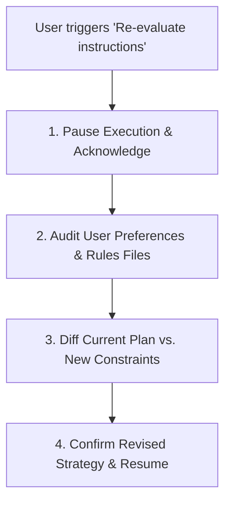

# Workflow Orchestrator UI & Dashboard Runbook

This skill equips agents and developers with the exact technical guidelines, architectural constraints, and operational runbooks required to build, test, and maintain the React 19 dashboard for the distributed Workflow Orchestrator.

---

## 1. Dynamic Instruction Re-evaluation Protocol

When the user commands you to **re-evaluate instructions** (e.g., *"re-evaluate your instructions"*, *"review your rules"*, *"align with new requirements"*):



### Steps:
1. **Pause & Acknowledge**: Stop generating code immediately. State:
   > *"Understood. Pausing current execution to re-evaluate operational instructions and align with your requirements."*
2. **Audit Guidance Sources**:
   - Inspect user's explicit chat instructions and feedback.
   - Inspect `.agents/rules/ui-dashboard-rules.md` and `workflow-orchestrator-dashboard/AGENTS.md`.
   - Inspect existing design system tokens and component constraints.
3. **Analyze Impact & Re-align**:
   - Re-evaluate the active task against the new directives.
   - Clarify any ambiguities or contradictions.
4. **Deliver Aligned Plan**:
   - Present a concise summary of the revised instructions and get confirmation or proceed directly based on user guidance.

---

## 2. Hard Scope Guardrail (Dashboard-Only)

Agents using this skill operate under a **Strict Read-Only Backend Policy**:
- **Allowed Modifications**:
  - `workflow-orchestrator-dashboard/src/**` (React components, hooks, styles, api client)
  - `workflow-orchestrator-dashboard/scripts/**` (Mock server, build scripts)
  - `workflow-orchestrator-dashboard/package.json` & `vite.config.js`
- **Protected / Read-Only**:
  - `workflow-orchestrator-core/`
  - `workflow-orchestrator-service/`
  - `workflow-orchestrator-management-service/`
  - Root `pom.xml`, Maven configurations, Docker Compose setups

---

## 3. Autonomous Mock Server Runbook

When developing or previewing the dashboard without an active Java backend, run the zero-dependency Node mock server:

### Commands
```bash
# Run standalone mock server (port 8080 by default)
npm run mock

# Run both mock server and Vite dev server simultaneously
npm run dev:mock
```

### Mock Route Index
- **Workflows List**: `GET /api/orchestrator/workflows` (supports `workflow`, `status`, `stepName`, `page`, `size`)
- **Workflow Detail**: `GET /api/orchestrator/workflows/:id`
- **Definition DAG**: `GET /api/orchestrator/workflows/definitions/:name`
- **Step Executions**: `GET /api/orchestrator/workflows/:id/steps`
- **Step Context**: `GET /api/orchestrator/workflows/:id/steps/:step/context`
- **Workflow Logs**: `GET /api/orchestrator/workflows/:id/logs`
- **Step Replay**: `POST /api/orchestrator/workflows/:id/steps/:step/replay` (in-memory state update)
- **Batch Replay**: `POST /api/orchestrator/workflows/replay`
- **Kafka Topics**: `GET /api/orchestrator/kafka/topics` & `GET /api/orchestrator/kafka/topics/:name`
- **Consumer Groups**: `GET /api/orchestrator/kafka/consumer-groups` & `GET /api/orchestrator/kafka/consumer-groups/:id`

### Chaos & Error Simulation
To test modern, informative error pages and boundary handling, append `simulateError` to any mock request:
```bash
# Simulates a 503 Service Unavailable error
curl "http://localhost:8080/api/orchestrator/workflows?simulateError=503"

# Simulates a 500 Internal Error
curl "http://localhost:8080/api/orchestrator/workflows?simulateError=500"
```

---

## 4. Chrome DevTools & Visual Evaluation Workflow

Use `chrome-devtools` or `browser_subagent` to visually preview and re-evaluate rendered UI changes:

1. **Launch Environment**:
   Ensure Vite dev server and mock server are active on `http://localhost:5173`.
2. **Viewport Checklist**:
   - **Desktop (1440 × 900)**: Verify expanded sidebar, 4-column stats grid, wide table, and uncrowded DAG canvas.
   - **Laptop (1280 × 800)**: Verify responsive column scaling and inspector drawer overlay.
   - **Tablet (768 × 1024)**: Verify compact top navigation, scrollable table card, and full-screen drawer.
   - **Mobile (375 × 667)**: Verify collapsed sidebar, 2-column stats, stacked filter grid.
3. **Console & Accessibility Audit**:
   - Check browser console: ensure **0 runtime errors** and **0 React key warnings**.
   - Verify keyboard focus states (`:focus-visible` outlines in ocean blue).
   - Verify all buttons and inputs meet tap target sizes (≥ 36px desktop, ≥ 44px touch).

---

## 5. Design System Tokens & Aesthetics

The UI follows a modern, minimal aesthetic tailored strictly for mission-critical monitoring:

### Palette Structure
```css
:root {
  /* Brand Theme */
  --dark-blue: #07192f;        /* Sidebar background, app frame, header depth */
  --dark-blue-surface: #0b1c36;/* Floating panels, active menu items */
  --ocean: #0284c7;            /* Primary brand accent, interactive elements */
  --ocean-hover: #0369a1;      /* Hover states */
  --ocean-soft: #e0f2fe;       /* Subtle pill backgrounds, active row tints */
  --ocean-glow: rgba(2, 132, 199, 0.15);

  /* Canvas & Neutral */
  --panel: #ffffff;            /* Card & panel surfaces */
  --bg: #f8fafc;               /* App background */
  --line: #e2e8f0;              /* Structural borders */
  --line-soft: #f1f5f9;         /* Dividers */
  --text: #0f172a;             /* High-contrast typography */
  --muted: #64748b;            /* Secondary metadata text */

  /* State Colors (Semantic) */
  --status-success: #10b981;   /* COMPLETED / SUCCESS */
  --status-success-bg: #ecfdf5;
  --status-running: #0ea5e9;   /* RUNNING / STARTED (with animated pulse) */
  --status-running-bg: #f0f9ff;
  --status-failed: #ef4444;    /* FAILED / ERROR */
  --status-failed-bg: #fef2f2;
  --status-suspended: #f59e0b; /* SUSPENDED / PAUSED */
  --status-suspended-bg: #fffbeb;
  --status-skipped: #64748b;   /* SKIPPED / CANCELLED */
  --status-skipped-bg: #f1f5f9;
}
```

---

## 6. Component Guidelines & Specifications

### 1. Screen Economy & Workflow Focus
- **No Redundant Views**: Do not navigate away from the workflow graph or execution list to view details. Use sliding inspection drawers for step contexts, metadata, and logs.
- **Immediate Replay**: Suspended and failed steps feature an in-place "Replay Step" button with immediate optimistic feedback.

### 2. Modern, Informative Error Pages & States
- Must feature:
  - Prominent HTTP / network diagnostic badge.
  - Human-friendly explanation with actionable troubleshooting tips.
  - Collapsible technical breakdown (endpoint URL, status code, timestamp).
  - Quick action buttons: **Retry Connection**, **Copy Diagnosis**, **Switch to Mock Mode**.

### 3. Reactive & Followable DAG Graph
- Built with `@xyflow/react` and Dagre auto-layout.
- Animated dashed edges on active transitions (`RUNNING`).
- Nodes display step title, status badge, latency, and retry counter.
- Interactive node click brings up the sliding step details inspector.

### 4. Sortable Tables with Humanized Fields
- Every table header (`Workflow`, `Status`, `Current Step`, `Created`, `Execution ID`) is sortable.
- Timestamps render human relative time (*"4m ago"*, *"Yesterday"*) with exact ISO tooltip.
- Durations render cleanly (*"420ms"*, *"1.8s"*, *"3m 14s"*).
- Column widths auto-adjust to content with ellipsis truncation and quick-copy buttons for IDs.

### 5. Form Fields Highlighting
- Every search input, select dropdown, and date picker must include:
  - Floating or visible label above the field.
  - Visible placeholder explaining expected format or syntax.
  - High-visibility focus ring (`2px solid var(--ocean)`).

### 6. App-Like Architecture & Portability
- Container layout locked to `100dvh` viewport height.
- Side navigation with collapsible icon mode (`238px` -> `72px`).
- Ready for PWA installability, Electron, or Tauri wrapper deployment.
